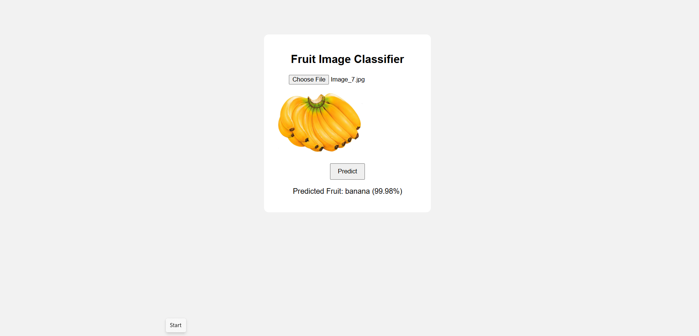

# 🍎 Fruit Image Classifier

AI-powered fruit image classifier using TensorFlow and MobileNetV2. Upload an image and get instant predictions for apples, bananas, cherries, and mangoes.


## 📸 Demo



## 🚀 Features

- **4 Fruit Categories**: Apple, Banana, Cherry, Mango
- **Deep Learning**: MobileNetV2 transfer learning
- **Real-time Predictions**: Instant classification with confidence scores
- **Simple UI**: Clean and responsive interface
- **Free Deployment**: Ready for Vercel + Render

## 📁 Project Structure

```
fruit-image-classifier/
├── app.py                 # Flask API server
├── requirements.txt       # Python dependencies
├── render.yaml           # Render deployment config
├── vercel.json           # Vercel deployment config
├── index.html            # Main HTML file
├── model/
│   ├── fruit_model.h5    # Trained model
│   └── labels.txt        # Class labels
├── dataset/              # Training images
│   ├── apple/
│   ├── banana/
│   ├── cherry/
│   └── mango/
├── training/
│   └── train_model.py    # Model training script
├── static/
│   ├── css/style.css
│   ├── js/script.js
│   └── uploads/
└── templates/
    └── index.html
```

## 🛠️ Tech Stack

- **Backend**: Flask, TensorFlow 2.10, NumPy
- **Frontend**: HTML, CSS, JavaScript
- **Model**: MobileNetV2 (ImageNet pretrained)
- **Deployment**: Vercel (Frontend) + Render (Backend)

## 📦 Installation

### Local Setup

1. **Clone the repository:**
```bash
git clone https://github.com/vaironix/fruit-image-classifier.git
cd fruit-image-classifier
```

2. **Install dependencies:**
```bash
pip install -r requirements.txt
```

3. **Run the app:**
```bash
python app.py
```

4. **Open browser:**
```
http://localhost:5000
```

## 🎯 Usage

1. Open the web app
2. Click "Choose File" and select a fruit image
3. Click "Predict"
4. View the predicted fruit and confidence score

## 🧠 Model Training

To retrain the model with your own dataset:

```bash
cd training
python train_model.py
```

**Training Details:**
- Architecture: MobileNetV2 (transfer learning)
- Input Size: 224x224 pixels
- Epochs: 10
- Train/Val Split: 80/20
- Optimizer: Adam
- Loss: Categorical Crossentropy

## 🌐 Deployment

### Deploy to Vercel + Render (Free)

**Full deployment guide:** See [DEPLOYMENT.md](DEPLOYMENT.md)

**Quick Steps:**
1. Push code to GitHub (public repo)
2. Deploy backend to Render
3. Update API URL in `static/js/script.js`
4. Deploy frontend to Vercel

## 📊 Model Performance

- **Training Accuracy**: ~95%
- **Validation Accuracy**: ~90%
- **Model Size**: ~9MB
- **Inference Time**: <1 second

## 🖼️ Dataset

- **Total Images**: 160 (40 per class)
- **Classes**: Apple, Banana, Cherry, Mango
- **Format**: JPG, PNG, JPEG
- **Source**: Custom collected dataset

## 🤝 Contributing

Contributions are welcome! Feel free to:
- Add more fruit categories
- Improve model accuracy
- Enhance UI/UX
- Fix bugs

## 📝 License

MIT License - feel free to use this project for learning and development.

## 👨💻 Author

**Vaironix** - [GitHub Profile](https://github.com/vaironix)

## 🙏 Acknowledgments

- TensorFlow team for MobileNetV2
- Flask framework
- Vercel & Render for free hosting

---

⭐ Star this repo if you find it helpful!
